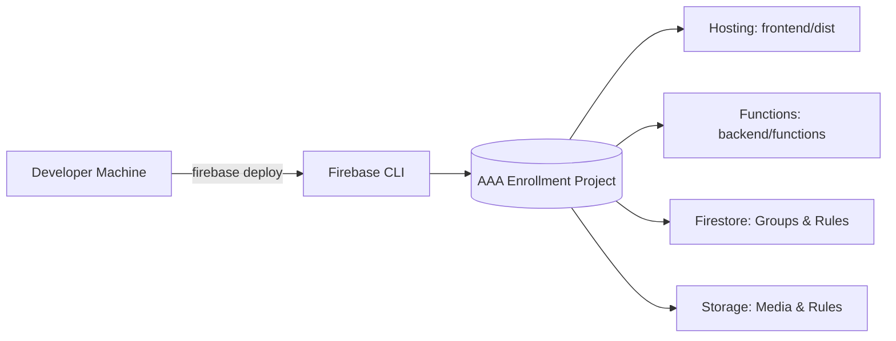

# Firebase Architecture Reference

This document defines the backend infrastructure strategy and data security boundaries for the AAA Online Enrollment System.

## Infrastructure Overview

The project uses a consolidated Firebase infrastructure to manage authentication, cloud functions, and database layers.

## Core Architectural Boundaries

### 1. The Configuration Hub (`backend/configs/`)
We maintain a strict separation between code and configuration. All security rules and schema indexes are isolated in the `backend/configs/` directory to ensure they are treated as part of the "Brain" (Backend) rather than the "Face" (Frontend).

- **`firestore.rules`**: Granular access control for the NoSQL store.
- **`storage.rules`**: Permissions for student document and program image uploads.
- **`firestore.indexes.json`**: Performance optimization for complex filtered queries.

### 2. Deployment Orchestration
The root `firebase.json` serves as the master manifest. It orchestrates how local directories map to Google Cloud services:
- **`frontend/dist`** maps to **Firebase Hosting**.
- **`backend/functions`** maps to **Cloud Functions**.

## Deployment Strategy

| Service | Source Folder | Security Concern |
| :--- | :--- | :--- |
| **Database** | `backend/configs/` | Access control & Indexing |
| **Functions** | `backend/functions/` | API authentication & Secrets |
| **Storage** | `backend/configs/` | File size limits & User IDs |
| **Hosting** | `frontend/dist/` | HTTPS & SEO Meta Tags |

## Command Reference

- `firebase deploy`: Full stack synchronization.
- `firebase emulators:start`: Local sandbox for end-to-end testing.
