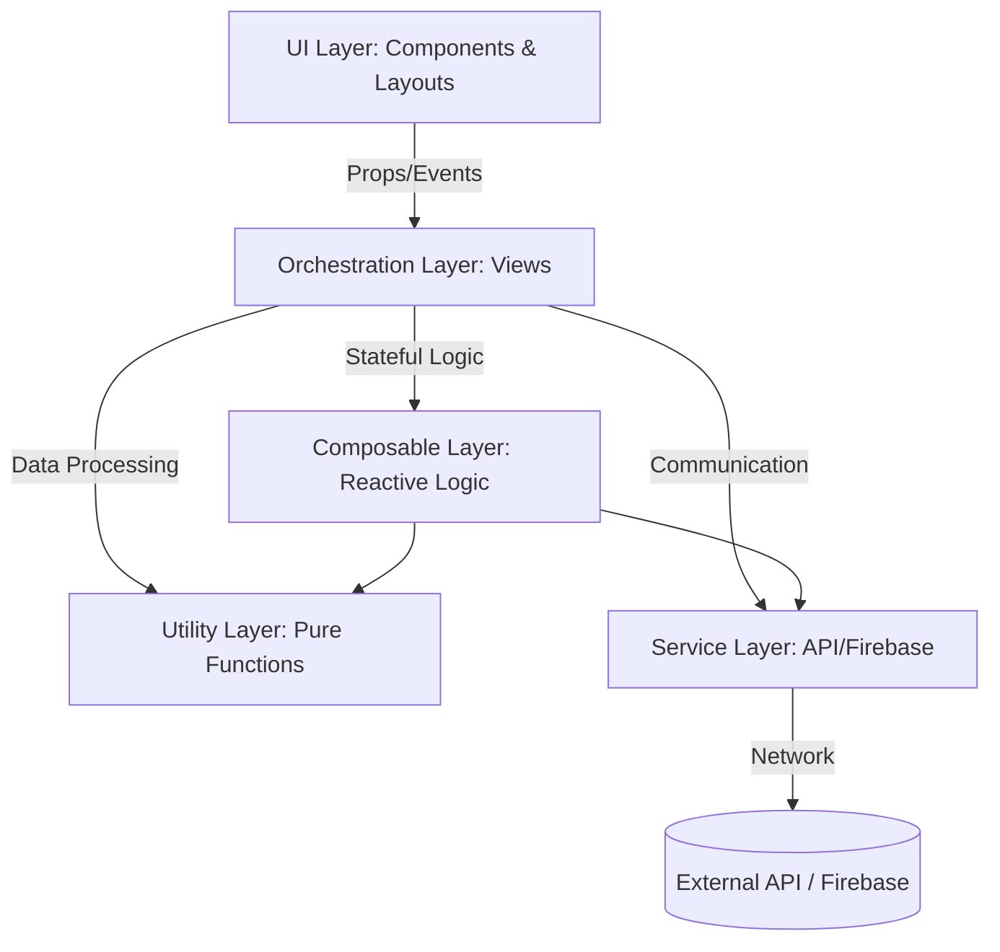

# Frontend Architecture Reference

This document defines the structural boundaries and core design patterns of the AAA Online Enrollment System frontend.

## High-Level System Design

The frontend is built on a **Layered Orchestration Architecture**. Each layer has a strict scope and cannot bypass intermediate layers.

## Layer Definitions

### 1. The Orchestration Layer (`src/views/`)
Views act as the "Brain" of a specific route. They orchestrate the flow of data between services and components but do not contain business logic or raw API knowledge.

### 2. The Service Layer (`src/services/`)
The primary interface for external communication.
- **`api.js`**: Core HTTP wrapper for Cloud Run.
- **`authService.js`**: Firebase Authentication interface.
- **`cache.js`**: Lightweight performance layer for API responses.

### 3. The Logic Layers
We distinguish between **Stateful** and **Stateless** logic:
- **Composables (`src/composables/`)**: Stateful reactive logic (e.g., search queries, menu states).
- **Utilities (`src/utils/`)**: Stateless pure functions (e.g., formatting, data mapping).

### 4. The UI Layer (`src/components/`)
Purely visual building blocks. They receive data via props and emit user actions via events. They are agnostic of where the data comes from.

## Execution Flow (The Initialization)

The application follows a "Strict Boot" sequence defined in `main.js`:
1.  **Firebase initialization**: Establish high-level connection.
2.  **Auth State Resolution**: Wait for the user's identity before mounting the app.
3.  **Plugin Injection**: Mount Router (navigation) and Pinia (state).
4.  **UI Mounting**: Render the root component and enter the view lifecycle.
