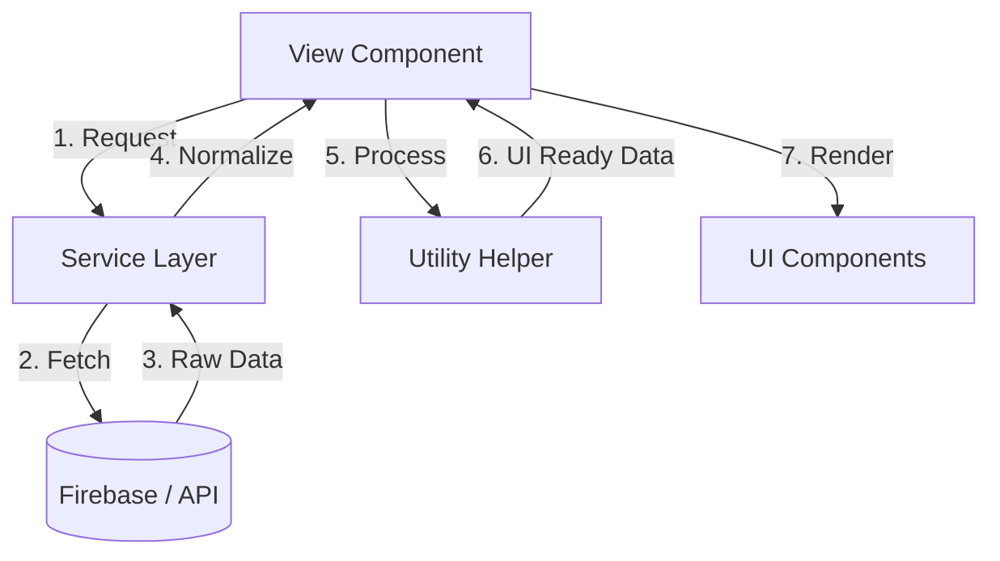

# View Orchestration Architecture

This document defines the architectural role of **Views** within the AAA Online Enrollment System. In this system, Views are not just pages; they are **Orchestrators**.

## The Orchestration Pattern

Views follow a strict pattern of delegating concerns to specialized layers, maintaining a "Lean View" philosophy.

## Architectural Responsibilities

### 1. Data Orchestration
Views are responsible for triggering data fetching. However, they do **not** know how the data is fetched. They merely call the Service layer.

### 2. Composition & Normalization
Views combine data from multiple sources (e.g., linking a Student to its Parent profile). This "joining" logic is orchestrated in the View but should ideally be processed by a **Utility**.

### 3. UI State Management
Views manage the high-level state of the page:
- **Loading States**: Global spinners or skeleton loaders.
- **Error Boundaries**: Handling and displaying service-level errors.
- **Modal Logic**: Controlling the visibility of action modals.

## The "Lean View" Constraints
To ensure maintainability, Views must adhere to these architectural constraints:
- **No Direct API Calls**: All communication must go through `src/services/`.
- **No Complex Math**: All calculations (stats, durations, etc.) must go through `src/utils/`.
- **No Direct State Mutation**: Use **Composables** (`src/composables/`) for complex UI behaviors like search or menu management.

## Summary of View Roles

| View Component | Domain | Primary Responsibility |
| :--- | :--- | :--- |
| `Dashboard.vue` | Analytics | Aggregates stats from all domains for overview. |
| `Students.vue` | Student Management | Orchestrates the primary student registry. |
| `Enrollments.vue` | Business Logic | Manages the core enrollment lifecycle. |
| `Parents.vue` | User Management | Manages parent/guardian profiles. |
| `Programs.vue` | Catalog | Orchestrates the academic offering. |
