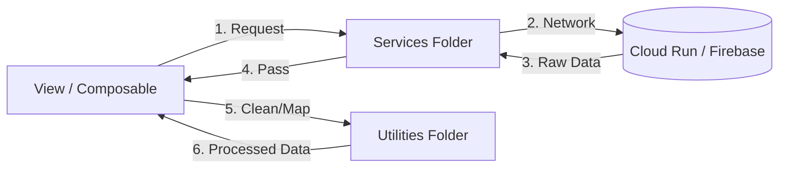

# Separation: Processing vs. Communication

This document defines the strict boundary between **Services** (Communication) and **Utilities** (Processing). This separation ensures that our data transformations are predictable and our network calls are centralized.

## The Architectural Split

## 1. Services: The Messengers (`src/services/`)
Services are the **only** files allowed to talk to the outside world.
- **Responsibility**: Fetching data, sending updates, and managing token authentication.
- **Analogy**: The **Waiter** who brings food from the kitchen but doesn't cook it.
- **Constraint**: Should NOT contain "Math" or "Business Rules". They return raw or globally normalized data.

## 2. Utilities: The Chefs (`src/utils/`)
Utilities are **Pure Functions** that transform data.
- **Responsibility**: Formatting dates, calculating totals, or mapping complex arrays.
- **Analogy**: The **Chef** who transforms raw ingredients into a meal.
- **Constraint**: Must be **Pure**. No network calls, no side effects, and no Vue reactivity (no `ref`).

## Why Distinguish?

| Feature | Service | Utility |
| :--- | :--- | :--- |
| **Network Access** | Yes | No |
| **Side Effects** | Yes | No |
| **Testability** | Requires Mocks | Easy (Pure Functions) |
| **Mentality** | "Where did it come from?" | "What does it look like?" |

## Best Practices
- **Service Naming**: End with `Service` (e.g., `enrollmentService.js`).
- **Utility Naming**: End with `Helper` or `Formatter` (e.g., `statsHelper.js`).
- If you find a Service performing complex `reduce()` or `map()` logic, extract that logic into a Utility.
