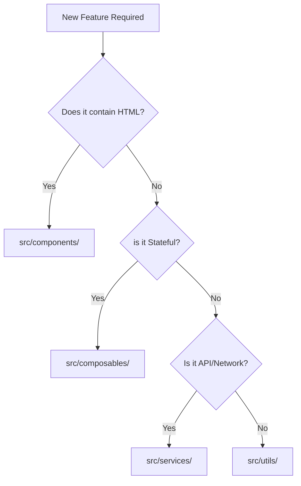

# Boundaries: State vs. Template

In this project, we maintain a strict boundary between **What the user sees** (Template) and **How it behaves** (Logic). This separation ensures that our UI remains consistent and our logic remains testable.

## Decision Flowchart: Where does the code go?

## 1. Components & Templates (`src/components/`)
**The Skin.**
- **Responsibility**: Rendering HTML, applying CSS, and emitting user events.
- **State**: Only UI-specific state (e.g., `isHovered`, `isModalOpen`).
- **Constraint**: Should never perform data transformations or direct API calls.

## 2. Composables (`src/composables/`)
**The Brain.**
- **Responsibility**: Managing shared reactive state (e.g., search queries, form sync).
- **State**: Reactive data that changes over time (`ref`, `computed`).
- **Constraint**: No HTML templates.

## 3. The Comparison Matrix

| Feature | Component | Composable |
| :--- | :--- | :--- |
| **Logic Type** | UI Presentation | Business Orchestration |
| **File Ext** | `.vue` | `.js` |
| **Contains HTML** | Yes | No |
| **Reusability** | Visual (Slots/Props) | Logic (Reactive State) |

## Maintenance Rule
If a Component's `<script>` section exceeds 100 lines, it is a signal that logic should be extracted into either a **Composable** (if stateful) or a **Utility** (if stateless).
